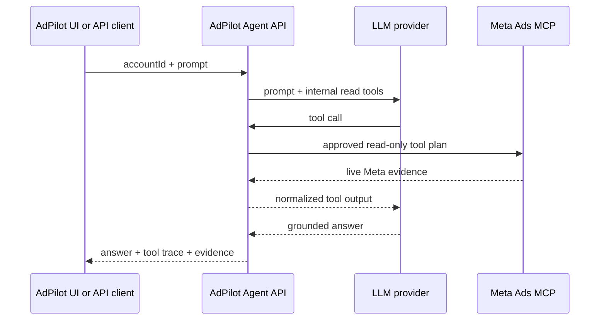

# AdPilot Agent API V1

## Purpose

AdPilot exposes its own agent endpoint. A caller supplies an account ID and a natural-language request; AdPilot runs a provider-backed LLM with a constrained set of **internal** tools. Those tools access live Meta data through AdPilot's existing server-side Ads MCP client.



## Endpoint

`POST /api/agent/run`

```json
{
  "accountId": "720643091975703",
  "prompt": "Audit the last 60 days. Identify the strongest sales campaigns and explain the next test.",
  "conversationId": "optional-client-reference"
}
```

The endpoint requires an existing AdPilot Meta session. The account ID is validated, and the current server-side Meta session is used. No access token is accepted from the caller.

## Available LLM tools

| Internal tool | What it does | Side effect |
| --- | --- | --- |
| `get_live_account_audit` | Fetches the fixed 60-day live audit through Meta MCP. | Read only |
| `get_top_campaigns` | Returns top spend or evidence-qualified campaigns from that audit. | Read only |
| `get_campaign_evidence` | Returns the deterministic score, gates, and metrics for one known campaign. | Read only |
| `get_dimension_patterns` | Rolls live campaigns up by region, product, or creative format with source labels. | Read only |
| `build_campaign_playbook` | Produces a deterministic, paused campaign recommendation from an explicit brief. | No Meta write |

The model does not receive `ads_create_*`, `ads_update_entity`, `ads_activate_entity`, a generic MCP tool call, raw provider payloads, OAuth tokens, or app secrets.

## Tool-call safety rules

1. The first live-data tool creates a single fixed audit for the requested account and 60-day window.
2. Later tools work only from that normalized in-memory audit; they do not accept an arbitrary Meta account ID or provider field list.
3. Every tool call is returned in a safe trace with its result type and timestamp.
4. Deterministic code calculates metrics, tiers, references, budget caps, and playbooks.
5. The LLM can explain evidence and select available tools. It cannot change a score, promote an ineligible campaign to winner, or publish a campaign.
6. Answers must name the source campaign ID for performance claims. Missing data is reported as `Not enough data`.

## Provider configuration

The first adapter uses the OpenAI Responses API with function calling. It is server-side only.

```text
OPENAI_API_KEY=<server-only key>
OPENAI_MODEL=gpt-5
```

`OPENAI_API_KEY` belongs only in `.env.local`; it is never added to source control, rendered in the browser, or sent to Meta. `OPENAI_MODEL` is configurable so the workspace owner can select a model available to their API project.

The endpoint returns `LLM_CONFIGURATION_REQUIRED` until this key is configured. The existing live audit remains usable without an LLM.

## Response contract

```json
{
  "runId": "agent_…",
  "source": "ADPILOT_AGENT_V1",
  "accountId": "720643091975703",
  "answer": "…",
  "toolTrace": [
    { "tool": "get_live_account_audit", "status": "ok", "at": "2026-08-29T…Z" }
  ],
  "evidence": {
    "auditId": "…",
    "window": { "since": "…", "until": "…", "days": 60 },
    "campaignIds": ["…"]
  }
}
```

## Boundaries

- This is AdPilot's API, not a hosted Claude or ChatGPT integration.
- Meta Ads MCP remains the live advertising-data provider.
- V1 is account-scoped, read-only, and synchronous.
- Conversations and traces are returned to the caller but not durably stored yet.
- Before production: add authentication, rate limits, durable encrypted sessions, privacy retention controls, observability, and approval-gated write workflows.
