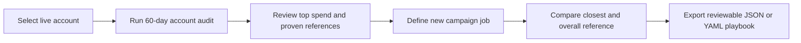

# Shipable V1 Product Flow

## The one job AdPilot V1 must do

Turn the evidence from **one selected Meta ad account** into a reviewable plan for the user's next campaign.

It is not an open-ended chat product, a campaign launcher, or a dashboard of unexplained scores. The experience is a short guided flow:

## The V1 screen contract

### 1. Account audit

This page answers only three questions:

1. **Where did money go?** Show the five highest-spending live campaigns.
2. **What has enough evidence to reuse?** Show only campaigns that pass the objective-aware evidence gates as references.
3. **What is missing?** Clearly state when region, product, creative format, or a success metric was not returned by Meta.

High spend is never labelled a winner. A campaign is only a proven reference after it has passed its evidence gate.

### 2. Define the next campaign job

The user explicitly supplies the new campaign intent before any playbook is created:

- Job to be done
- Objective
- Target region
- Product or offer
- Daily budget

AdPilot may suggest values inferred from a campaign name, but those values are clearly labelled and never silently used as the user's plan. There are no fabricated defaults such as an unrelated city, offer, or campaign objective.

### 3. Evidence match

After the user submits the brief, AdPilot shows:

- **Closest best**: the strongest eligible reference matching the new brief at the most-specific available region/product/JTBD rung.
- **Overall best**: the strongest eligible reference for the same JTBD/objective across the account.
- The exact matching rung and any fallback.

If no reference qualifies, state that plainly and offer an explicitly requested cold-start plan. Do not auto-generate one.

### 4. Playbook

Only after a user confirms the brief does AdPilot produce a playbook. It contains the proposed configuration, evidence links, assumptions, warnings, field-level provenance, and copyable JSON/YAML. It remains paused/read-only and requires human review before a future execution phase.

## What is intentionally not on the primary screen

- Raw Meta MCP tool calls or tool traces.
- A general-purpose agent prompt as the first action.
- Automatically generated playbooks.
- Placeholder regions, offers, budgets, or campaign objectives.
- A claim that incomplete data is a winning pattern.

The LLM/API agent remains useful as a programmatic and secondary explanation layer. It must return structured, evidence-grounded content; it must not replace the guided V1 decision flow.

## Data and safety contract

- Every displayed account metric is read fresh from the currently selected Meta account for the current audit request.
- The browser may remember the selected account identity for convenience; it does not persist raw campaign performance data.
- If Meta returns no delivered campaigns, or lacks a required dimension, show `Not enough data` and explain the limitation.
- V1 uses only read-only tools. No campaign is created, changed, paused, or launched.
